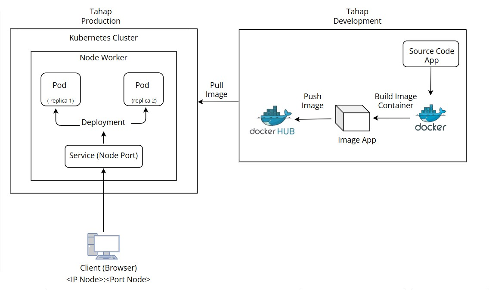
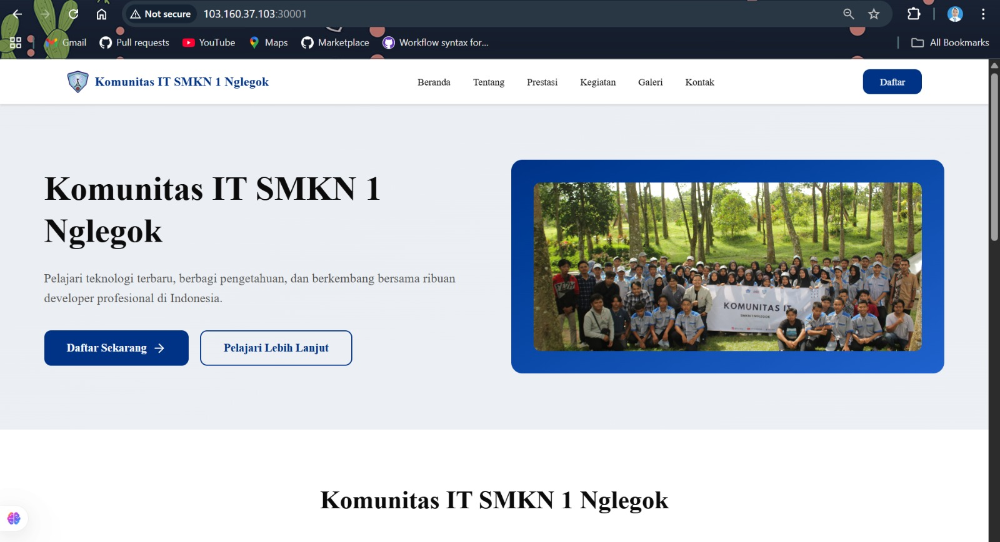
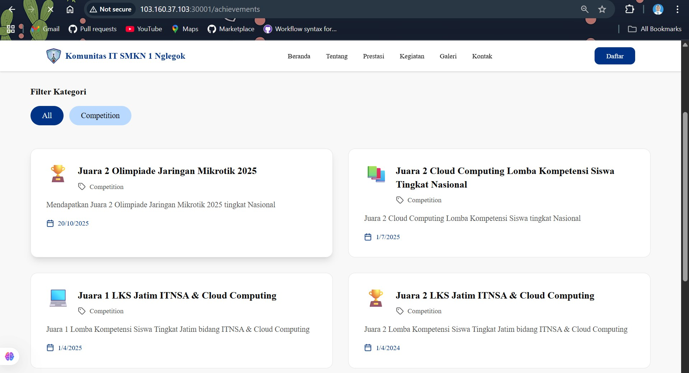

# 🚀 Deployment Guide — Forkits Website (Production)

Dokumentasi ini menjelaskan langkah-langkah untuk membangun image Docker, mendorongnya ke registry (Docker Hub), serta melakukan deployment ke **Kubernetes (K3s)** single node cluster.

---



---

## 🧱 Build Image

Langkah ini digunakan untuk membangun image dari source code aplikasi.
1. Clone repository
```
root@103-160-37-103 ~] git clone https://github.com/destiaeka/forkits-website.git
root@103-160-37-103 ~] cd forkits-website
```
2. Build image Docker
```[
[root@103-160-37-103 forkits-website]# docker build -t destiaeka/forkits-web .
 ```
4. Verifikasi image sudah terbuat
```
[root@103-160-37-103 forkits-website]# docker image ls
```
> 💡 Tips: Pastikan kamu berada di direktori yang berisi file Dockerfile sebelum menjalankan perintah build.

## ☁️ Push Image ke Registry
Setelah image berhasil dibuat, kita perlu mendorongnya ke Docker Hub agar bisa digunakan oleh Kubernetes untuk melakukan pull image saat deploy.
```
[root@103-160-37-103 ~]# docker push destiaeka/forkits-web
```
> ⚠️ Jika kamu belum login ke Docker Hub, jalankan terlebih dahulu:
``` docker login ```

## ⚙️ Instalasi K3s (Single Node Cluster)

Di sini digunakan K3s single cluster karena ringan dan cocok untuk kebutuhan development maupun staging.
1. Install K3s
```
[root@103-160-37-103 ~]# curl -sfL https://get.k3s.io | sh -
```
3. Konfigurasi Kubeconfig untuk Non-root User
Agar user biasa bisa menjalankan kubectl, lakukan konfigurasi berikut:
```
[root@103-160-37-103 ~]$ su - ides
[ides@103-160-37-103 ~]$ mkdir -p $HOME/.kube
[ides@103-160-37-103 ~]$ sudo cp /etc/rancher/k3s/k3s.yaml $HOME/.kube/config
[ides@103-160-37-103 ~]$ sudo chown $(id -u):$(id -g) $HOME/.kube/config
```
3. Verifikasi Cluster Berjalan
```
[ides@103-160-37-103 ~]$ kubectl get nodes
NAME                         STATUS   ROLES                  AGE   VERSION
103-160-37-103.cprapid.com   Ready    control-plane,master   21h   v1.33.5+k3s1
```
> ✅ Jika status node Ready, berarti K3s sudah berhasil dijalankan

## 🚀 Deploy Aplikasi ke Kubernetes
File manifest untuk deploy bernama forkits-deployment.yml.
File ini berisi 3 resource utama:
- Deployment — mendefinisikan container.
- Service — untuk expose aplikasi ke luar cluster.
- Ingress — mengatur routing HTTP/HTTPS di luar cluster ke service didalam cluster.
- Horizontal Pod Autoscaler (HPA) — untuk auto-scale pod berdasarkan penggunaan CPU.

1. Apply Manifest
Masuk ke direktori produksi dan apply konfigurasi:
```
[ides@103-160-37-103 ~]$ cd forkits-website/production
[ides@103-160-37-103 ~]$ kubectl apply -f forkits-deployment.yml
```
2. Verifikasi Resource
Cek apakah deployment, service, dan HPA sudah berjalan:
```
[ides@103-160-37-103 ~]$ kubectl get all
NAME                                      READY   STATUS    RESTARTS      AGE
pod/forkits-deployment-569b7f5c48-cz8qz   1/1     Running   1 (40m ago)   132m
pod/forkits-deployment-569b7f5c48-q5mc7   1/1     Running   1 (40m ago)   132m

NAME                  TYPE        CLUSTER-IP      EXTERNAL-IP   PORT(S)        AGE
service/forkits-svc   NodePort    10.43.104.143   <none>        80:30001/TCP   132m
service/kubernetes    ClusterIP   10.43.0.1       <none>        443/TCP        133m

NAME                                 READY   UP-TO-DATE   AVAILABLE   AGE
deployment.apps/forkits-deployment   2/2     2            2           132m

NAME                                            DESIRED   CURRENT   READY   AGE
replicaset.apps/forkits-deployment-569b7f5c48   2         2         2       132m

NAME                                              REFERENCE                       TARGETS              MINPODS   MAXPODS   REPLICAS   AGE
horizontalpodautoscaler.autoscaling/hpa-forkits   Deployment/forkits-deployment   cpu: <unknown>/50%   2         5         2          132m
```
Kamu akan melihat minimal 2 pod aktif (hasil scaling dari HPA).

## Untuk mengakses web dari browser:

Cek ingress:
```
[ides@103-160-37-103 forkits-website]$ kubectl get ingress
NAME              CLASS     HOSTS                     ADDRESS          PORTS   AGE
forkits-ingress   traefik   forkits.destiaeka.local   103.160.37.103   80      15m
```

Akses di browser menggunakan HOST yang tertera di resource ingress
```forkits.destiaeka.local```

## ‼️ NOTE
apabila gagal kalian bisa menambahkan host di komputer secara manual. hal ini disebebkan karena hostname belum dikenali oleh sistem DNS pada komputer. Untuk langkah langkahnya sebagao berikut
1. buka notepad -> Run as Administrator
2. buka file C:\Windows\System32\drivers\etc\hosts
3. tambahkan ip dan dns ingress
4. simpan dan keluar

# ✅ Result


